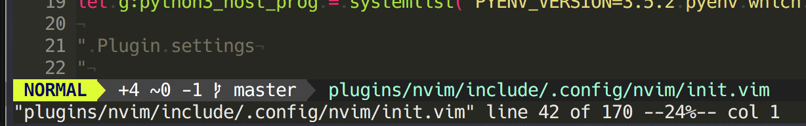

# Disable the text that appears below the status line

It is annoying that whenever you switch between buffers in *Vim* you see this ugly message in the bottom:



Looking for ways to disable it, I stumbled upon [this question](https://unix.stackexchange.com/questions/140898/vim-hide-status-line-in-the-bottom). I finally found [an answer on SO](http://stackoverflow.com/a/23489658/2622966) that actually fixes it.

All you need to do is add `:silent` on the keybinding of your buffer switchers.

```vim
nmap <silent> <Leader>n :silent :bnext<CR>
nmap <silent> <Leader>N :silent :bprev<CR>
```
